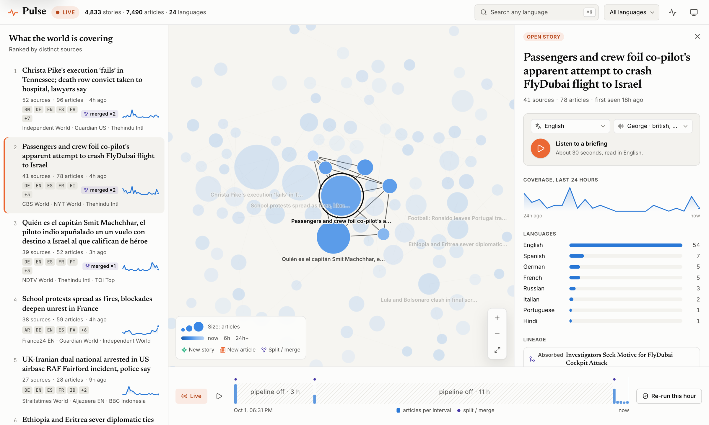
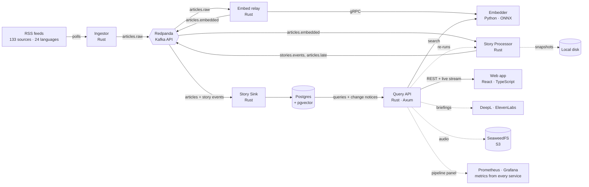
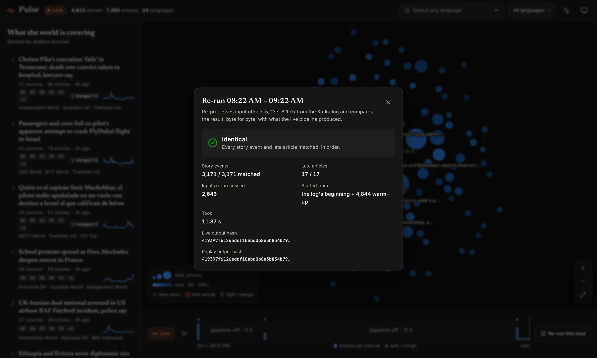

# Pulse

Pulse reads the news from 133 sources in 24 languages as it's published, and
groups articles about the same event into **stories**, even when they're written
in different languages. You can watch stories appear, grow, split apart and merge
in real time, scroll back to any moment in the past, and listen to a short spoken
summary of any story in your own language.

Under the hood it's built like a production data system. If any part crashes,
even halfway through saving something, nothing is lost and nothing is counted
twice. And because it always makes the same decisions from the same input, you can
re-run any past hour and check that it produces exactly the same result.

<picture>
  <source media="(prefers-color-scheme: dark)" srcset="docs/img/pulse-dark.png">
  
</picture>

## Contents

- [What you can do](#what-you-can-do)
- [Run it on your computer](#run-it-on-your-computer)
- [A tour of the app](#a-tour-of-the-app)
- [How it works](#how-it-works)
- [How stories are formed](#how-stories-are-formed)
- [Never losing or repeating work](#never-losing-or-repeating-work)
- [Re-running the past](#re-running-the-past)
- [Listen in any language](#listen-in-any-language)
- [Performance](#performance)
- [API](#api)
- [For developers](#for-developers)
- [Known limitations](#known-limitations)

## What you can do

- **Follow the news live.** Articles from around the world are grouped into stories within seconds of being published.
- **Watch stories change.** A live map shows new stories appearing, growing as more outlets cover them, and splitting or merging, with the history of each change.
- **Go back in time.** Drag the timeline to see exactly what the news looked like at any earlier moment.
- **Search in any language.** Type in Spanish and find the English, French or Arabic coverage of the same event.
- **Check that it's correct.** Press "Re-run this hour" and Pulse processes that hour again from scratch and proves it gets the identical result.
- **Listen.** Hear a 30-second summary of a story, translated into your language.
- **See it working.** A live panel shows how fast articles flow through each step.

## Run it on your computer

### What you need

| | why | how to get it |
|---|---|---|
| **Docker** (with Compose) | runs the databases and message system | [Docker Desktop](https://www.docker.com/products/docker-desktop/) |
| **Rust** | builds most of Pulse | [rustup.rs](https://rustup.rs) (the right version is picked automatically) |
| **Python 3.12 or newer** | runs the AI model that reads articles | [python.org](https://www.python.org/downloads/) |
| **Node.js 22 and pnpm** | builds the website | [nodejs.org](https://nodejs.org), then run `corepack enable` |
| **make** | runs the commands below | already on macOS and Linux |

You'll also need about 2 GB of free disk space. No accounts or API keys are
needed to get started.

### Start it

Open a terminal and run these one at a time.

**1. Get the code**

```bash
git clone https://github.com/DAmin05/Pulse.git
```
```bash
cd Pulse
```

**2. Start the background services** (databases, message log, monitoring). The
first time takes a few minutes while Docker downloads them.

```bash
make up
```

**3. Download the AI model** (about 450 MB, only needed once). This model turns
each article into a list of numbers that captures its meaning, in any language.

```bash
make model
```

**4. Install the website's packages** (only needed once).

```bash
make web-install
```

**5. Start Pulse.** This builds and starts every part of it. The first build takes
a few minutes. Leave this terminal open; press `Ctrl-C` to stop.

```bash
make pipeline
```

**6. Open the website.** In a *second* terminal, inside the same folder:

```bash
make web
```

Then go to **http://localhost:5173**.

On its first run, Pulse fetches the last three days of articles from every source,
so within a few minutes you'll see thousands of articles and hundreds of stories.
A story shows up on the map once at least two different outlets have covered it.

### Optional: translation and natural voices

The Listen feature works without any setup: your browser reads the summary aloud
using stories already available in your language. For translation into any
language and natural-sounding voices, add two free API keys:

1. **DeepL** (translation): sign up for the free *DeepL API Free* plan at
   [deepl.com/pro-api](https://www.deepl.com/pro-api) and copy your key (it ends in `:fx`).
2. **ElevenLabs** (voices): create a free account at [elevenlabs.io](https://elevenlabs.io),
   then go to *Developers → API Keys* and create a key.
3. Open the `.env` file in the Pulse folder (step 2 created it) and fill in:
   ```
   DEEPL_API_KEY=your-deepl-key
   ELEVENLABS_API_KEY=your-elevenlabs-key
   ```
4. Stop `make pipeline` with `Ctrl-C` and start it again.

Keep `.env` private: it's never committed. Pulse limits how much of your free
allowance it uses each day, and playing the same summary again is free.

### Stopping and starting again

- **Stop:** press `Ctrl-C` in the `make pipeline` and `make web` terminals, then
  run `make down` to stop the background services. Your data is kept.
- **Start again later:** `make up`, then `make pipeline`, then `make web` in a
  second terminal. (Steps 3 and 4 never need repeating.)
- **Start completely fresh:** `make nuke` deletes all stored data.

### If something goes wrong

| problem | what to do |
|---|---|
| `Cannot connect to the Docker daemon` | Start Docker Desktop and try again. |
| `port is already allocated` or `address already in use` | Another program is using one of Pulse's ports (see [services and ports](#services-and-ports)). Close it, or stop an older Pulse with `make down`. |
| `make model` fails | Usually a network hiccup; run it again. It checks the download, so a broken file is never used. |
| The website says it can't load stories | Make sure `make pipeline` is running. `make doctor` checks every service and says what's wrong. |
| The map is empty | Give it a few minutes on the first run: stories appear once two outlets have covered the same event. |
| Something else | `make doctor` checks the whole setup. `make logs` shows the background services' logs. |

## A tour of the app

- **Top stories** (left): stories ranked by how many different outlets cover them,
  with their languages, sources and a small chart of activity over the last 24
  hours. The "Live activity" box shows articles as they arrive.
- **Story map** (center): every circle is a story. Bigger means more articles;
  brighter means more recent; important stories sit near the middle; lines connect
  related stories. New stories pop in, stories pulse when an article joins, and
  merging stories fly into each other. Hover for a summary, click to focus.
- **Story panel** (right): the full story with its coverage over time, languages,
  where it split from or merged with, every article (with links to the original),
  and its change history.
- **Search** (`⌘K` or `/`): search by meaning in any language.
- **Timeline** (bottom): drag it, or use the arrow keys, to see the news at any
  past moment; press play to watch it unfold. Hatched areas mark times when Pulse
  wasn't running. "Re-run this hour" proves the result is reproducible.
- **Pipeline panel** (pulse icon, top right): how fast articles move through each
  step, and how far behind each step is.
- **Listen**: inside the story panel. Pick a language and press play.
- Light and dark themes, full keyboard support, reduced motion if your system asks
  for it, and layouts that work down to phone size.

## How it works



In plain terms, an article goes through six steps:

1. **Ingestor** checks each news feed every few minutes, politely. It gives every
   article an ID based on its web address, so the same article is never added twice.
2. **Kafka** (run locally with Redpanda) is the backbone: an ordered, permanent log
   that every step reads from and writes to. Because it's a log, any step can be
   stopped and restarted and pick up exactly where it left off.
3. **Embedder** reads each article's title and summary and turns it into 384
   numbers that capture its meaning. Articles about the same event get similar
   numbers, *whatever language they're in*. The **embed relay** feeds it articles
   and saves the results.
4. **Story Processor** is the brain. It decides which story each article belongs
   to, spots copies of the same wire story, and splits or merges stories as
   coverage evolves. Every decision is written to the log as an event.
5. **Story Sink** saves everything into Postgres, in a way that keeps the full
   history, so any past moment can be looked up.
6. **Query API** serves the website: the stories, the map, search, the live
   stream of changes, re-runs and the Listen feature.

Rust is used for everything that has to be fast and reliable; Python for the AI
model, because that's where the model tools are; TypeScript and React for the
website.

### The log's topics

| topic | what's in it | kept for |
|---|---|---|
| `articles.raw` | every article as fetched (3 partitions) | 30 days |
| `articles.embedded` | every article with its meaning-numbers; the processor's input and the record everything else can be rebuilt from (1 partition) | forever |
| `stories.events` | every story change: created, article added, updated, split, merged, closed | forever |
| `articles.late` | articles that arrived too late to start a story (more than 24 hours old) | 30 days |

`articles.embedded` deliberately has a single partition, so every article has
one fixed position in one sequence. "The state after article N" then means the
same thing every time, which is the basis of time travel, crash recovery and
re-runs.

### Design choices

| choice | why |
|---|---|
| Own nearest-neighbour index (HNSW) instead of a library | Library indexes make random choices while building, so results can differ between runs. Pulse needs identical results every time. |
| Correcting each language's "accent" in the meaning-numbers | The raw numbers group articles by language before topic. Removing each language's average tripled the number of cross-language stories. |
| Saving progress inside the same database transaction as the data | Exactly-once writes to Postgres without complicated two-phase protocols. |
| Story membership stored with the range of log positions it was valid for | Any past moment is a simple query, not a reconstruction. |
| Postgres + pgvector, no separate vector database | One store, and search volume is small. |
| Server-sent events for the live stream | One-way, resumable by design, works through proxies. |

## How stories are formed

For each new article, in order:

1. **Exact repeat** (same ID): ignored.
2. **Near copy** (the same wire story republished by another outlet, detected by
   comparing overlapping 5-character chunks with MinHash, ≥ 80% similar): attached
   to the original's story as a syndicated copy, but not used to shape the story.
3. **Vote:** the 10 most similar earlier articles vote for their stories. The
   article joins the winner if it also fits that story's overall meaning;
   otherwise it starts a new story.

What made this work well:

- **Removing each language's accent.** Raw embeddings place unrelated articles in
  the same language closer together than the same event in two languages.
  Subtracting each language's average (fixed, stored in `config/centering/`)
  fixed that and **tripled cross-language stories**.
- **Guarding against drift.** Without care, a chain of loosely similar headlines
  grows into one giant story about "anything to do with 2027 budgets". To join an
  established story (3+ articles), an article needs 2 of that story's members
  among its neighbours, and must fit the story about as well as its existing
  members do.

**Splits and merges.** Every 100 articles, stories that changed are checked
again. A story **splits** when its articles clearly form two separate groups
(both with at least 3 articles, and less than 0.50 similar to each other). Two
stories **merge** when they're very similar (≥ 0.72) *and* share a distinctive
word that appears almost only in those two stories, like "Flydubai" (but not
"budget"), or when they're extremely similar (≥ 0.82). A change must hold for two
checks in a row, and stories involved then rest for a while, so they don't flip
back and forth.

**Late news.** Pulse uses the time an article was *published*, not when it was
fetched. It keeps a "watermark": the newest publish time it has seen, minus 24
hours. An article older than the watermark can still join an open story (marked
*late*), but can't start a new one; it goes to `articles.late` instead. Stories
with no new articles for 48 hours close, and their articles are released from
memory.

**Results**

| test data | articles | stories with 2+ sources | cross-language stories | index accuracy | speed |
|---|---:|---:|---:|---:|---:|
| RSS feeds, 72 hours | 3,989 | 302 | 118 | 99.6% | ~900 articles/s |
| GDELT worldwide, 4 hours | 49,220 | 5,477 | 1,236 | 97.8% | ~700 articles/s |

On the RSS data, all 4 merges were correct (for example, the FlyDubai co-pilot
fragments, and a Russian-language report merging into the English story) and
there were no wrong splits. "Index accuracy" is how often the fast search finds
the same 10 nearest articles as checking every article one by one.

## Never losing or repeating work

The promise: **every article affects the result exactly once**, even if any part
is force-killed at any moment, including halfway through saving.

The idea is simple: each step saves its output **and** a bookmark of how far it
has read **in one all-or-nothing save**. After a crash, either both were saved or
neither was, so the step resumes from its bookmark and redoes only unfinished work.

| step | saves | together with its bookmark, in |
|---|---|---|
| Embed relay | the articles' meaning-numbers | one Kafka transaction |
| Story Processor | story events and late articles | one Kafka transaction (up to 500 articles at a time) |
| Story Sink | rows in Postgres | the same Postgres transaction |
| Live stream | changes sent to the browser | each message carries its position, so a reconnecting browser asks for exactly what it missed |

**The Story Processor** keeps a lot in memory (every open story, its search
indexes, the watermark). Every 5,000 articles or 5 minutes, after a successful
save, it writes a snapshot of that memory to disk. When it restarts, it loads the
latest snapshot and **quietly re-processes** the articles between the snapshot and
its bookmark to rebuild its memory, without re-sending anything. This only works
because it's **deterministic**: the same articles in the same order always produce
exactly the same decisions. To guarantee that, it never uses the clock, randomness
or anything that depends on timing, only positions in the log. Snapshots record
the settings they were made with, and Pulse refuses to resume from a snapshot
made with different settings.

**The live stream** never gets ahead of the database: the sink announces new
changes inside the same database transaction, so the announcement only goes out
once the data can actually be read.

**How it's tested**

- **Processor crash test** (`scripts/chaos/processor.sh`, runs in CI): 20,000
  articles are processed twice: once normally, once while the processor is
  force-killed 50 times at random moments. Latest run: 50 kills, 51 restarts and
  30,750 articles quietly re-processed during recovery, and the output was
  **identical**: 22,294 story events and 460 late articles, byte for byte.
- **Relay crash test** (`scripts/chaos/relay.sh`): killed 5 times mid-save while
  re-processing 7,490 articles. Result: 7,490 outputs, 0 duplicates.
- **Restore-anywhere test**: for random inputs and a random snapshot point,
  snapshot, restore and continue. Both the output and the final memory must equal
  an uninterrupted run.
- **Database test**: applying the entire history twice changes nothing.

Note: fetching articles is the one step that can, after a crash, publish an
article twice. That's harmless: the copy has the same ID, and the processor
ignores repeats.

## Re-running the past

Because processing is deterministic, any stretch of the log can be processed again
and compared, byte for byte and in order, with what was saved the first time.

```bash
make replay              # the entire history
make replay FROM=4500    # from log position 4500 onward
```

Or press **Re-run this hour** under the timeline:



| re-run | started from | story events | late articles | result |
|---|---|---:|---:|---|
| entire history | the beginning | 4,912 / 4,912 | 704 / 704 | identical (6.1 s) |
| one window | a snapshot | 513 / 513 | 1 / 1 | identical (2.3 s) |
| last hour, from the app | the beginning | 3,171 / 3,171 | 17 / 17 | identical (11.4 s) |
| entire history with one setting nudged by 0.01 | the beginning | 928 / 4,912 | 702 / 704 | **different**, as it should be |

The last row is the control: a check that can never fail proves nothing, so a
tiny change in one setting must be caught, and it is.

## Listen in any language

Open a story, choose a language and press play. Pulse reads a 30-second summary
and highlights each word as it's spoken; click any word to jump there.

**The summary** only uses what the news outlets wrote, so nothing is invented: the
headline, how widely the story is covered ("More than 50 sources in 12 languages
are covering this story"), then up to three summaries from different outlets,
credited by name. It prefers articles already written in your language (no
translation needed), skips near-identical summaries, and tidies up feed text such
as "LONDON (Reuters) -" prefixes.

**Translation** (DeepL) is only used for the parts not already in your language.
**Voice** comes from ElevenLabs, which also reports when each word is spoken,
which is what drives the highlighting.

**Keeping costs down.** Translations and recordings are saved and reused, so
asking for the same summary again is instant and free (24 ms in testing, with no
calls to either service). Usage is tracked per day and checked against limits
before every paid request. When there's no key, the limit is reached, or a service
fails, your browser's built-in voice reads the summary instead.

| setting in `.env` | default | meaning |
|---|---|---|
| `DEEPL_API_KEY` | none | DeepL key; free keys end in `:fx` |
| `ELEVENLABS_API_KEY` | none | ElevenLabs key; the free plan requires crediting ElevenLabs, which the player does |
| `PULSE_TTS_DAILY_CHARS` | 3000 | most characters to send for speech per day |
| `PULSE_TRANSLATE_MONTHLY_CHARS` | 400000 | most characters to translate per month (DeepL Free allows 500,000) |
| `PULSE_BRIEFING_MAX_CHARS` | 520 | summary length, about 30 seconds |
| `PULSE_AUDIO_STORE` | `s3` | where recordings are kept: `s3` (SeaweedFS) or `local` (`data/audio`) |

## Performance

All measured on an Apple M3 Pro laptop, CPU only, with real articles.

### Grouping articles for the AI model

The model works faster on a group of articles than on one at a time, so the
embedder waits a few milliseconds to collect requests into a batch. The surprise:
on a CPU, **bigger batches made it slower**.


The reason is padding: every article in a batch is padded to the length of the
longest one, and article lengths vary a lot. With 64 articles per batch, almost
every batch contains one long article, so most of the work is spent on padding.
The fix was to sort each batch by length and process it in smaller groups of
similar length (at most 1,024 padded tokens per group).

| precision | batching | 1 per batch | 64 per batch | slowest 1% at 64 |
|---|---|---:|---:|---:|
| fp32 | plain | 99 articles/s | **64 articles/s** (−35%) | 1,352 ms |
| fp32 | sorted by length | 99 articles/s | **107 articles/s** (+8%) | 727 ms |
| int8 | plain | 190 articles/s | **149 articles/s** (−22%) | 644 ms |
| int8 | sorted by length | 188 articles/s | **213 articles/s** (+13%) | 546 ms |

*(64 simultaneous senders. Full results of all 144 runs: [docs/bench/embedder.md](docs/bench/embedder.md).)*

Also: when traffic is light, waiting to fill a batch only adds delay. With 4
senders, waiting 20 ms instead of 0 cut throughput from 96 to 60 articles/s. The
defaults are int8, batches of up to 64, a 5 ms wait and the 1,024-token limit.

### The smaller model (int8) is almost identical

The int8 model runs about twice as fast as the full-precision (fp32) one. On
2,000 articles, the two produce nearly the same numbers: median similarity 0.997,
lowest 0.992. About 85% of each article's 10 nearest neighbours are the same; the
rest swap among near-ties such as wire copies. Every part of Pulse uses the same
saved int8 numbers, and the story settings were tuned on them.

### Everything else

| | |
|---|---|
| Story Processor | ~900 articles/s on real feeds; the live feeds deliver about 10 per minute |
| Re-running the entire history | 5,037 articles in 6.1 s |
| Fetched → saved with meaning-numbers | 0.44 s median, live |
| Model time per batch | 87.5 ms (95th percentile), live |

To reproduce: `make bench FIXTURE=data/fixtures/<file>.pulsefx` for batching, and
`embedder/bench/precision.py` for int8 vs fp32.

## API

The Query API runs at `http://localhost:9105`. Every read endpoint accepts
`?at=<log position>` or `?as_of=<time>` to see the past.

| endpoint | returns |
|---|---|
| `GET /api/stories?sort=sources\|size\|recent&lang=&min_sources=&limit=` | Top stories: headline, languages, counts, top sources, 24-hour activity |
| `GET /api/stories/{id}` | One story: articles, splits and merges, change history |
| `GET /api/graph` | The story map: stories and the similarity links between them |
| `GET /api/search?q=` | Search by meaning, across languages |
| `GET /api/timeline?buckets=` | Activity over time, with the log position for each moment |
| `GET /api/stats` | Totals and how far behind each step is |
| `GET /api/pipeline` | The pipeline panel: rates and delays from Prometheus |
| `GET /api/sources` | The feed list with article counts |
| `POST /api/replays` · `GET /api/replays/{id}` | Start a re-run and get its report |
| `GET /api/listen` · `POST /api/stories/{id}/briefing` · `GET /api/audio/{key}` | Listen: languages and voices, a summary, its recording |
| `GET /api/stream` | Live stream of story changes (server-sent events); reconnecting resumes where it left off |
| `GET /metrics` | Prometheus metrics |

Try `curl localhost:9105/api/stories?limit=5` or `curl -N localhost:9105/api/stream`.

## For developers

### Checks

```bash
make check       # everything CI runs: Rust format, lint and tests; protobuf lint; Python lint and tests; website lint and tests
make test-db     # database tests against the local Postgres
```

CI also starts the full stack and runs the processor crash test.

### Running parts separately

Instead of `make pipeline`, each service can run on its own:

```bash
make ingest      # fetch feeds          (metrics :9101)
make embedder    # the AI model          (gRPC :50061, metrics :9102)
make relay       # attach meaning-numbers (metrics :9106)
make process     # form stories          (metrics :9103)
make sink        # save to Postgres      (metrics :9104)
make api         # serve the website     (:9105)
make web         # the website           (:5173)
```

### Tools

```bash
make sources-check                          # test every feed once, publish nothing
make fixture-record                         # save the last 24 h of articles to data/fixtures/
make cluster-eval EMBEDDED=<file>.pulseem   # story quality on saved data
make cluster-sweep EMBEDDED=<file>.pulseem  # try a range of thresholds
make ann-recall EMBEDDED=<file>.pulseem     # index accuracy vs checking everything
make chaos-relay                            # crash test the relay
make chaos-processor KILLS=10               # crash test the processor
make reset-processor                        # clear story data to re-process from scratch (after changing settings)
pulse topic check <topic>                   # count records and duplicates in a topic
pulse topic hash <topic>                    # fingerprint a topic's contents
```

To add a news source, add a `[[source]]` block to `config/sources.toml`, then
check it with `cargo run -p ingestor -- check --source <id>`.

### Configuration

All settings live in `.env` (created from `.env.example` by `make up`), with
comments. The defaults work as they are.

### Grafana dashboard

Grafana (http://localhost:3000, `admin` / `pulse`) has a ready-made "Pulse
pipeline" dashboard. It's generated by `deploy/grafana/build_dashboard.py`: edit
that, run it, and restart Grafana with
`docker compose -f deploy/docker-compose.yml restart grafana`.

### Services and ports

| service | address | notes |
|---|---|---|
| Website (dev) | http://localhost:5173 | `make web` |
| Query API | http://localhost:9105/api | also `/metrics` |
| Grafana | http://localhost:3000 | `admin` / `pulse` |
| Prometheus | http://localhost:9090 | collects metrics from ports 9101–9106 |
| Redpanda Console | http://localhost:8081 | browse the log's topics |
| Kafka (Redpanda) | `localhost:19092` | |
| Postgres + pgvector | `localhost:5432` | `pulse` / `pulse` |
| SeaweedFS (S3) | http://localhost:8333 | stores Listen recordings |

All passwords here are for local development only.

### Project layout

```
crates/
  pulse-core/        shared message types, Kafka settings, article IDs
  pulse-cli/         `pulse` developer tool: doctor, fixtures, topic checks
  ingestor/          fetches feeds → articles.raw
  embed-relay/       articles.raw → Embedder → articles.embedded
  story-processor/   forms stories; crash recovery; re-runs
  pulse-store/       Postgres tables and queries, including time travel
  story-sink/        log → Postgres
  query-api/         the API, live stream, search, re-runs, Listen
embedder/            the Python model service and its benchmarks
web/                 the website (React)
proto/               message definitions (protobuf)
config/              news sources, per-language corrections
deploy/              Docker services, Prometheus and Grafana setup
scripts/             pipeline runner, crash tests
docs/                screenshots, benchmark results, project plan
```

## Known limitations

- **Headline-only sources** (like GDELT) can group look-alike stories from
  different countries ("government presents 2027 budget"), and recurring content
  such as horoscopes clusters together. This is rare in the curated RSS feeds.
- **One story processor.** All articles pass through one processor in one strict
  order, which keeps it deterministic. It handles ~900 articles a second, far
  above the actual news rate, but it isn't built to scale out.
- **Which articles exist** depends on when feeds were checked. Everything after
  an article is fetched is exactly reproducible.
- **Local setup only.** There's no hosted deployment yet.
