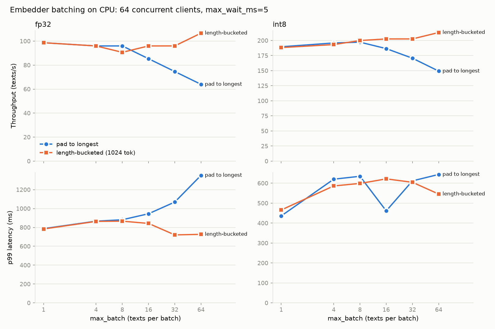

# Pulse

Real-time, multilingual news aggregator. Articles stream in from RSS feeds and news
APIs, are embedded and deduplicated as they arrive, and are grouped into evolving
stories that grow, split and merge, all with exactly-once semantics, event-time
watermarks and deterministic replay.

See [docs/PLAN.md](docs/PLAN.md) for the full design and roadmap.

## Layout

```
crates/
  pulse-core/        shared protobuf types, Kafka configs, topic names, article ids
  pulse-cli/         `pulse` developer CLI (doctor, fixture record/stats)
  ingestor/          RSS + GDELT polling → articles.raw
  embed-relay/       articles.raw → Embedder → articles.embedded (Kafka transactions)
  story-processor/   clustering engine, watermarks, snapshots, exactly-once live mode
  pulse-store/       Postgres read model: schema, exactly-once writer, time-travel queries
  story-sink/        articles.embedded + stories.events → Postgres (offsets in the same txn)
  query-api/         Axum REST + SSE (live, resumable) over the read model
embedder/            Python gRPC embedding service (ONNX, dynamic batching)
web/                 React + TypeScript frontend (Vite): story graph, time travel, metrics
proto/               protobuf schemas (buf-managed)
config/              sources.toml (feed catalog), centering/ (frozen per-language means)
deploy/              docker-compose stack and its config
docs/                design and plan
```

## Prerequisites

- Rust (the version is pinned in `rust-toolchain.toml`; rustup installs it automatically)
- Docker with Compose v2
- Python 3.12+

`protoc` and `buf` don't need to be installed: Rust uses a vendored `protoc`, and
`make proto-lint` runs `buf` in Docker.

## Quick start

```bash
make up        # start the stack, create topics and buckets
make model     # download the embedding model (once)
make pipeline  # run everything: ingest → embed → cluster → Postgres → API (Ctrl-C stops all)
make web       # the frontend at http://localhost:5173 (after `make web-install`)
make doctor    # verify the stack from the host
make check     # fmt, clippy, tests, buf lint, embedder tests
```

Then try `curl localhost:9105/api/stories?limit=5` or `curl -N localhost:9105/api/stream`.

`make help` lists all targets. `make nuke` deletes all local data.

## Ingestor

Polls ~130 RSS feeds in 25+ languages (see [config/sources.toml](config/sources.toml))
and publishes `pulse.v1.Article` messages to `articles.raw`, keyed by article id.

```bash
make sources-check   # poll every source once, print a health table, publish nothing
make ingest          # run continuously (metrics on :9101/metrics)
make fixture-record  # snapshot the last 24h of articles.raw into data/fixtures/
```

- **Politeness:** conditional GET (ETag / Last-Modified), first polls staggered across
  the interval, ±10% jitter, at most 2 concurrent requests per host, exponential
  backoff on errors, `Retry-After` honored.
- **No duplicate publishing:** URLs are canonicalized before hashing into ids. A seen
  set skips items already published and is rebuilt from `articles.raw` on startup, so
  restarts don't republish.
- **Event time:** the publisher's timestamp. Missing or future timestamps fall back to
  fetch time and are flagged `event_time_corrected`. Items older than `max_age` (72h)
  are skipped.
- **Language:** configured per source, then the feed's declared language, then
  detection (`detect_lang = true` for mixed-language feeds). Normalized to ISO 639-1.
- **GDELT:** off by default for live use (high volume, mostly local news, headlines
  only). Use it for load-test fixtures:

  ```bash
  cargo run -p ingestor --release -- backfill-gdelt --stream translingual \
    --from 2026-10-01T00:00:00Z --to 2026-10-01T06:00:00Z --out data/fixtures/gdelt.pulsefx
  ```

  Fixture output is deterministic for a given range: ordered by `(fetched_at, id)`,
  with `fetched_at` set to the slot's end time.

Add a feed by appending a `[[source]]` block, then run
`cargo run -p ingestor -- check --source <id>`.

## Embedding

```bash
make model        # download multilingual-e5-small (pinned revision, sha256-checked) + build int8
make embedder     # gRPC on :50061, metrics on :9102
make relay        # articles.raw → articles.embedded, exactly once
make chaos-relay  # kill -9 the relay 5 times mid-run; verify 1 output per input
make bench FIXTURE=data/fixtures/<file>.pulsefx
```

- **Model:** `multilingual-e5-small` (384 dimensions, ~100 languages, shared vector space
  across languages). Inputs get the `passage: ` / `query: ` prefixes e5 was trained
  with. Mean pooling, then L2 normalization. `model_version` records the revision,
  precision and token limit, since all three change the vectors.
- **Dynamic batching:** a batch closes at `max_batch` texts or `max_wait_ms` after its
  first request, whichever comes first. Inference runs on one worker thread, so the
  next batch fills while the current one runs.
- **Length bucketing:** each batch is sorted by token length and split into
  sub-batches of at most `PULSE_EMBEDDER_TOKEN_BUDGET` padded tokens (default 1024).

### Benchmark: batch size vs latency (Apple M3 Pro, CPU)



Under load (64 clients sending one article each), **naive dynamic batching makes CPU
throughput worse**: every batch is padded to its longest text, and article lengths vary
a lot. With fp32, going from batch 1 to batch 64 drops throughput from 99 to 64 texts/s.
Length bucketing reverses that: batch 64 reaches **107 texts/s (fp32, +67%)** and
**213 texts/s (int8, +43%)**, with lower p99 latency. At light load, a `max_wait_ms`
larger than the arrival gap is pure added latency (20 ms halves throughput), so keep it
small. Defaults: int8, `max_batch=64`, `max_wait_ms=5`, token budget 1024. Full grid in
[docs/bench/embedder.md](docs/bench/embedder.md). p99 from 3-second runs is noisy,
so trust the trends over single points.
- **Exactly once:** the relay embeds each batch of `articles.raw`, then writes the
  vectors and the consumed offsets in **one Kafka transaction**. A crash anywhere
  either commits both or neither. On error it aborts and exits, and a restart resumes
  from the last commit. `scripts/chaos/relay.sh` proves this with repeated `kill -9`.
- **Vectors are computed once.** Downstream consumers and replay read them from
  `articles.embedded` and never re-embed, because results can shift slightly with
  batch composition.

`pulse topic check <topic>` counts committed records and duplicate keys in any topic.

## Story Processor

```bash
pulse fixture record --topic articles.embedded --since 72h --out data/fixtures/x.pulseem
make cluster-eval EMBEDDED=data/fixtures/x.pulseem   # stories, quality stats, weakest joins
make cluster-sweep EMBEDDED=...                     # threshold grid
make ann-recall EMBEDDED=...                        # HNSW vs brute force
embed-relay embed-fixture in.pulsefx out.pulseem    # embed a raw fixture offline
```

For each embedded article, in log order:

1. **Exact duplicate** (same id): ignored.
2. **Near duplicate** (MinHash LSH on character 5-grams, 128 hashes in 16×8 bands,
   estimated Jaccard ≥ 0.8): attached to the original's story as a syndicated copy.
   It stays out of the vector index and the centroid.
3. **Vote:** the 10 nearest articles in a deterministic **HNSW** index (our own
   implementation: seeded levels, ties broken by key) vote for their stories. The
   winner is joined if the article also fits the story's centroid. Otherwise it
   starts a new story.

What made clustering work:

- **Per-language mean centering.** Raw e5 vectors are anisotropic: unrelated articles
  in the same language score about 0.78 cosine, and each language has its own offset,
  so same-language topic clusters crowd out cross-lingual matches of real events.
  Subtracting frozen per-language means (`config/centering/<model>.json`, fit with
  `story-processor calibrate`) centers unrelated pairs at 0. That **tripled
  cross-lingual stories** at equal coverage.
- **Drift guards.** Joining an established story (3+ articles) needs 2 of its members
  among the neighbors, and centroid fit within 0.10 of the story's own cohesion.
  Without them, chains of locally similar headlines grow into "anything about 2027
  finances". With them, the largest GDELT cluster shrinks from 160 to 100 articles
  while multi-source stories increase.

| fixture | articles | stories with ≥2 sources | cross-lingual | HNSW recall@10 (ef 64) | throughput |
|---|---:|---:|---:|---:|---:|
| RSS, 132 feeds, 72h | 3,989 | 302 | 118 | 0.996 | ~900/s |
| GDELT translingual, 4h | 49,220 | 5,477 | 1,236 | 0.978 | ~700/s |

Output is deterministic: the same fixture gives the same event hash on every run
and across debug/release builds.

### Event time, exactly-once and recovery

```bash
make process                          # live: articles.embedded → stories.events (+ articles.late)
make chaos-processor KILLS=10         # kill -9 repeatedly; output must match a clean run byte for byte
pulse fixture synth --out x.pulseem   # deterministic synthetic stream (late, dupes, drifting topics)
pulse fixture publish --file x.pulseem --topic <topic>
pulse topic hash <topic>              # order-sensitive fingerprint of committed records
```

- **Watermark** = max event time − 24h allowed lateness, derived only from the log.
  A **late** article (behind the watermark) can join an open story, flagged `late`,
  but never creates one. Instead it goes to `articles.late`. On the cold-start RSS
  fixture, 6h lateness dropped 52% of inputs as late, 24h drops 17% (only the stale
  backlog), and 48h drops 5%.
- **Housekeeping on event-time ticks** (every 10 min of watermark, never wall clock):
  stories idle for 48h close (`StoryClosed`) and their articles leave memory. The
  HNSW index tracks evicted entries as tombstones and is rebuilt once they pass 20%,
  so state stays bounded without per-eviction rebuilds.
- **Exactly once:** each epoch (≤500 inputs) commits its story events, its late
  articles and the next input offset in one Kafka transaction.
- **Log-structured checkpoints:** state (zstd + bincode, ~11 MB for 4k articles) is
  snapshotted every 5,000 inputs or 5 minutes, *after* a commit. On restart, the
  processor loads the newest snapshot at or before the committed offset and
  **silently replays** the gap from Kafka; determinism makes the rebuilt state
  identical. So the log is the write-ahead log, and snapshots can be rare while
  commits stay frequent. A snapshot records a fingerprint of the config and
  centering, and resuming it under different settings is refused.
- **Proof:** a property test snapshots at random points, restores, and checks that
  events *and final state bytes* equal an uninterrupted run. `scripts/chaos/processor.sh`
  runs the real thing: a clean run vs a run SIGKILLed up to 50 times, with tiny
  epochs and frequent snapshots. Both output topics must have identical hashes. CI
  runs 50 kills on 20k synthetic articles.

### Lineage: splits and merges

```bash
story-processor lineage --fixture data/fixtures/x.pulseem   # every split/merge with headlines + similarity probes
make reset-processor                                        # clear processor state + outputs after config/schema changes
```

Every 100 inputs (a position in the log, so deterministic; and it's when stories
change), stories that changed since the last check are re-evaluated:

- **Split:** a deterministic 2-means over a story's indexed members. If both halves
  have ≥3 members and their centroids are less than 0.50 similar, the story splits:
  `StorySplit` lists which articles go to which child, each child gets a
  `StoryCreated` with `parent_story_ids`, and the parent gets `StoryClosed(SPLIT)`.
- **Merge:** established stories whose centroids are ≥0.72 similar *and* share an
  **anchor word**, or ≥0.82 without one. A word anchors a pair when at least half
  of the live articles using it are in those two stories: "Flydubai" or "Bardella"
  qualify, "budget", "2027" or "Sendung" don't. That separates real same-event
  fragments from template look-alikes at similar embedding scores.
- **Anti-flapping:** a candidate must qualify on 2 consecutive checks; the merge
  threshold sits well above the split threshold; and stories involved sit out 6
  checks afterwards.

Tuning results: RSS gets 4 merges, all correct (FlyDubai fragments, Bardella/Mediapart,
the Russian Christa Pike story into the English one) and 0 splits; its most
separable large story is still one event (halves 0.74 similar). On headline-only
GDELT, most of the 59 merges are correct cross-lingual ones (Vietnamese → Spanish
helicopter crash, Malvinas, Plavšić, Pakistan–Afghanistan), but template clusters
formed at join time (budgets by country, TV listings, horoscopes, ballot numbers)
merge with each other. Fixing those needs entity- or content-type features, not
thresholds. Split threshold 0.50 gives no false splits; at 0.55 GDELT split one
event by language.

Snapshot/restore stays exact with lineage active: the property test includes
split-heavy and merge-heavy configurations, and the chaos test passes on real data
while merges are happening.

Known limitations: same-template events in different countries ("government
presents 2027 budget") share a story on headline-only data, and lineage can't
separate them; evergreen genres (horoscopes) cluster together. Both are rare in the
curated RSS feeds and common in GDELT.

## Read model & API

The **sink** applies `articles.embedded` and `stories.events` to Postgres. Each batch's
rows **and the consumed offsets** commit in one transaction, and the sink resumes
from offsets stored in Postgres, so it's exactly-once without Kafka commits. Every
statement is also idempotent (tested by applying a whole history twice).

**History is versioned by log position.** Each article's story membership is stored
as a validity range `[from_offset, to_offset)` in `articles.embedded`, so splits and
merges close rows instead of overwriting them, and any past state is a query: pass
`?at=<offset>` or `?as_of=<RFC 3339 time>` to any read endpoint. "Now" is just the
latest position, so live views and time travel share one code path.

| Endpoint | Returns |
|---|---|
| `GET /api/stories?sort=sources\|size\|recent&lang=&min_sources=&limit=` | Story cards: headline, languages, counts, top sources, 24h activity sparkline, lineage ids |
| `GET /api/stories/{id}` | Articles (with duplicate/late flags), parents, children, merged from/into, event history |
| `GET /api/graph?limit=&min_sources=&min_similarity=` | Nodes + similarity edges (centroid cosine) + split edges + recent splits/merges |
| `GET /api/search?q=` | Cross-lingual semantic search (e5 query → pgvector), grouped by story; `strong` flags real matches |
| `GET /api/timeline?buckets=` | Articles / new stories / splits / merges / closes per time bucket (every bucket, empty ones included), with the offset to jump to |
| `GET /api/stats` | Totals, Kafka end offsets, sink position and lag per topic |
| `GET /api/pipeline` | Pipeline panel: rates, latencies and watermark lag from Prometheus (latest + 30 min series), consumer lag per stage (cached 5 s) |
| `GET /api/sources` | Feed catalog with article counts and last fetch |
| `POST /api/replays` · `GET /api/replays[/{id}]` | Re-drive a window of the input log and diff it against the live output (see Replay) |
| `GET /api/stream` | **SSE** of committed story events (`event: story`, `id: <offset>:<seq>`); resume with `Last-Event-ID` or `?after=` |
| `GET /metrics` | Prometheus (request latency per route, live clients) |

The stream is fed by a Postgres `NOTIFY` that the sink sends **inside its
transaction**, so a streamed event is always already queryable. There's no race
between "event arrived" and "story not in the DB yet". A reconnecting client
replays exactly what it missed (verified: 966 events, in order, no duplicates),
then continues live.

Verified live: with `make pipeline`, 846 fresh articles flowed from RSS to the SSE
stream in 4 minutes (622 new stories, 220 joins, 2 live merges), with zero warnings
from any service and sink lag 0.

## Frontend

```bash
make web-install
make web                          # http://localhost:5173, proxies /api to :9105
PULSE_API=http://localhost:9115 make web   # point it at another API
make web-check                    # eslint + tsc + vitest
```

React 19 + TypeScript, Vite, TanStack Query for reads and one `EventSource` for the
live stream. Everything on screen is a view of a log position: "live" follows the
latest one, and any other position is time travel through the same endpoints.

- **Story graph.** A d3-force simulation drawn on canvas. Area tracks article
  count, color tracks recency, and important stories sit near the center. Live
  events animate in place: new stories are born (or burst out of a split parent),
  articles pulse their story, and merges fly the absorbed story into its target
  along a dashed lineage line. Hover for a summary; click to focus a story and its
  neighbours.
- **Feed and drawer.** Stories ranked by distinct sources, with a live activity
  ticker. The drawer shows coverage over 24h, languages, lineage links, every
  article (syndicated copies and late arrivals flagged) and the story's event history.
- **Search (⌘K).** Semantic and cross-lingual: a Spanish query finds English coverage.
- **Timeline.** Input per interval over the whole history, with merges and splits
  marked. Drag or use the arrow keys to time travel, press play to watch history
  unfold, or "Re-run this hour" to replay that window through the processor and see
  the byte-for-byte verdict with both hashes. Stretches when the pipeline was off
  are shown as such, not as quiet news.
- **Pipeline panel.** Each stage with its consumer lag, plus throughput, latency
  and watermark lag sparklines from Prometheus.

Light and dark themes (palette checked for color-blind safety and contrast),
keyboard access throughout, `prefers-reduced-motion` respected, and layouts down to
phone width.

## Replay: proving determinism on live data

```bash
make replay                       # whole history vs what the live processor committed
make replay FROM=4500             # a window (input offsets), warmed up from a live snapshot
story-processor replay --from-time 2026-10-01T22:34:00Z --output-topic replay.x.stories
story-processor replay --perturb-neighbor-similarity 0.49   # shows the diff catching a change
curl -X POST localhost:9105/api/replays -d '{"from_time":"…","to_time":"…"}' -H 'content-type: application/json'
```

A replay restores the newest live snapshot at or before `from` (or starts from the
log's beginning, which is always valid), silently processes up to `from`, then
re-drives `[from, to)`. It compares the result **byte for byte, in order** with the
events the live processor committed to `stories.events` for the same inputs, and
with the articles it routed to `articles.late`. `to` is clamped to the live
processor's committed offset. The report gives counts, an order-sensitive hash of
each side, and the first divergence if any. Replays only read live topics; they can
write to an isolated `replay.<id>.stories` topic (24h retention) with the same
format as live output.

On the live history (the cold-start backlog plus live RSS, with the processor
restarted from snapshots several times along the way):

| replay | warm-up | events | late | result |
|---|---|---:|---:|---|
| whole history `[0, 5037)` | from scratch | 4,912 / 4,912 | 704 / 704 | **identical** (6.1 s) |
| `[4500, 5037)` | snapshot @4020 + 404 inputs | 513 / 513 | 1 / 1 | **identical** (2.3 s) |
| whole history, `neighbor_similarity` 0.50 → 0.49 | from scratch | 928 / 4,912 match | 702 / 704 | **different**: first at input 413, same join with a different vote score |

The perturbed run is the control: a diff that can't fail proves nothing. Through
the API, replays run one at a time in the background, their reports are stored in
Postgres, and runs interrupted by an API restart are marked failed. CI runs replays
of both the clean and the crash-tested processor output inside the chaos test.

## Local services

| Service | URL | Notes |
|---|---|---|
| Kafka API (Redpanda) | `localhost:19092` | |
| Redpanda Console | http://localhost:8081 | browse topics and messages |
| Redpanda admin/metrics | http://localhost:19644 | |
| Postgres + pgvector | `localhost:5432` | `pulse` / `pulse` |
| S3 (SeaweedFS) | http://localhost:8333 | buckets `pulse-checkpoints`, `pulse-audio` |
| SeaweedFS master | http://localhost:9333 | |
| Query API | http://localhost:9105/api | REST + SSE; `/metrics` too |
| Frontend (dev) | http://localhost:5173 | `make web` |
| Prometheus | http://localhost:9090 | scrapes host services on ports 9101–9106 |
| Grafana | http://localhost:3000 | `admin` / `pulse` |

All credentials are local-development values. Real API keys go in `.env`, which is
gitignored.

## Kafka topics

| Topic | Partitions | Retention | Purpose |
|---|---|---|---|
| `articles.raw` | 3 | 30 days | Ingestor output, keyed by article id |
| `articles.embedded` | 1 | forever | Processor input and replay source of truth |
| `articles.late` | 1 | 30 days | Articles beyond allowed lateness |
| `stories.events` | 1 | forever | Story graph changes (transactional) |
