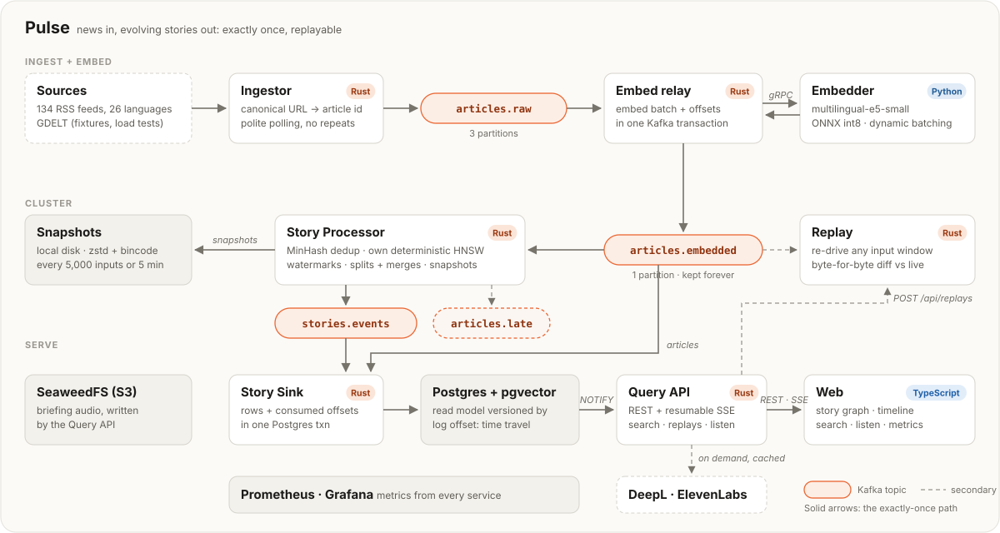

# Architecture



Pulse is a streaming pipeline with a log at its center. Each stage reads a Kafka
topic (Redpanda locally), does one job, and commits its output together with its
progress, so any stage can crash and restart without losing or repeating work
([exactly-once.md](exactly-once.md)).

## Components

| component | language | does | port (metrics) |
|---|---|---|---|
| **Ingestor** | Rust | Polls 134 RSS feeds (26 languages) politely; canonicalizes URLs into article ids; publishes `pulse.v1.Article` | 9101 |
| **Embedder** | Python | gRPC service: multilingual-e5-small on ONNX Runtime (int8), dynamic batching with length bucketing | 50061 (9102) |
| **Embed relay** | Rust | `articles.raw` → Embedder → `articles.embedded`, one Kafka transaction per batch | 9106 |
| **Story Processor** | Rust | Near-duplicate detection, clustering, watermarks, splits and merges; story events out, exactly once; also runs replays | 9103 |
| **Story Sink** | Rust | Applies articles and story events to Postgres with the consumed offsets in the same transaction; `NOTIFY` on commit | 9104 |
| **Query API** | Rust (Axum) | REST, resumable SSE, semantic search, time travel, replays, pipeline metrics, briefings | 9105 |
| **Web** | TypeScript (React) | Story graph, feed, timeline, search, metrics panel, listen player | 5173 (dev) |

Why the split: the hot path (polling, transactions, clustering, serving) is in
Rust for predictable latency, memory and a single static binary per service; the
model runs in Python because that's where ONNX tooling, tokenizers and model
export live, behind a narrow gRPC interface (`proto/pulse/v1/embedder.proto`).

## Topics

| topic | partitions | retention | contents |
|---|---:|---|---|
| `articles.raw` | 3 | 30 days | Ingestor output, keyed by article id |
| `articles.embedded` | 1 | forever | Articles with vectors; the processor's input and the replay source of truth |
| `stories.events` | 1 | forever | `StoryEvent`s: created, article added, updated, split, merged, closed |
| `articles.late` | 1 | 30 days | Articles that arrived behind the watermark and couldn't join a story |
| `replay.<id>.stories` | 1 | 24 h | Optional isolated output of a replay run |

Messages are protobuf (`proto/pulse/v1/`, linted with `buf`). `articles.embedded`
has one partition on purpose: its offsets are a total order over every input,
which is what makes processing deterministic and every past state addressable.

## Storage

- **Postgres + pgvector**: the read model. Articles (with their e5 vectors for
  search), stories, memberships with validity ranges over input offsets (so any
  past state is a query), every story event (for history and SSE catch-up), sink
  offsets, replay reports, and the briefing caches.
- **Local disk**: Story Processor snapshots (`data/checkpoints/story-processor`),
  zstd-compressed, written after commits and pruned to the newest five.
- **SeaweedFS (S3 API)**: briefing audio.
- **Prometheus + Grafana**: metrics from every service, a provisioned dashboard,
  and the source for the UI's pipeline panel.

## Request paths

- **Live view**: the browser loads stories and the graph over REST, then holds one
  `EventSource` on `/api/stream`. The sink's `NOTIFY` wakes the API, which reads
  the new events from Postgres and pushes them. On reconnect, `Last-Event-ID`
  resumes exactly where the client left off.
- **Time travel**: the same endpoints with `?at=<offset>`; the UI's timeline maps
  time to offsets.
- **Search**: the API embeds the query (e5 `query:` prefix) through the Embedder,
  then pgvector finds the nearest articles across all languages, grouped by story.
- **Replay**: `POST /api/replays` queues a run; the API runs the processor's replay
  in the background, one at a time, and stores the report.
- **Listen**: `POST /api/stories/{id}/briefing` composes a briefing from the read
  model, translates and synthesizes it through caches and budgets, and returns
  text, word timings and an audio URL.

## Design decisions

| decision | why | alternative considered |
|---|---|---|
| Own HNSW implementation | Library ANN indexes are nondeterministic (random levels, parallel builds) and rarely serializable; determinism is the foundation of recovery and replay | Brute force (fine at today's volume, but O(n) per article) |
| Per-language mean centering of embeddings | Raw e5 vectors cluster by language before topic; centering tripled cross-lingual stories | Translating everything to English first (slow, costly) |
| Offsets in the sink's own Postgres transaction | Exactly-once into a non-Kafka store without two-phase commit | Kafka offset commits after writes (at-least-once) |
| Memberships as offset ranges | Time travel and lineage history become plain queries, never reconstruction | Event-sourced rebuild per request |
| Postgres + pgvector, no separate vector DB | One store, transactional with the read model; search volume is small | Qdrant |
| SSE, not WebSockets | One-way stream, resumable by design with `Last-Event-ID`, works through proxies | WebSockets |
| Log-structured snapshots + silent replay | Commits stay frequent and cheap; snapshots can be rare | Snapshot every commit |
| Single processor partition | Total order makes determinism simple; throughput is ~100× the feed rate | Partitioned processing with a deterministic merge |

## Repository layout

```
crates/
  pulse-core/        protobuf types, Kafka client configs, topic names, article ids
  pulse-cli/         `pulse` developer CLI: doctor, fixtures, topic checks and hashes
  ingestor/          RSS + GDELT polling → articles.raw
  embed-relay/       articles.raw → Embedder → articles.embedded
  story-processor/   clustering engine, watermarks, lineage, snapshots, live + replay
  pulse-store/       Postgres schema, exactly-once writer, time-travel queries
  story-sink/        topics → Postgres
  query-api/         REST + SSE + search + replays + listen
embedder/            Python gRPC embedding service and benchmarks
web/                 React frontend
proto/               protobuf schemas
config/              sources.toml (feed catalog), centering/ (frozen per-language means)
deploy/              docker-compose stack, Prometheus and Grafana config
scripts/             pipeline runner, chaos tests
docs/                design notes and write-ups
```
